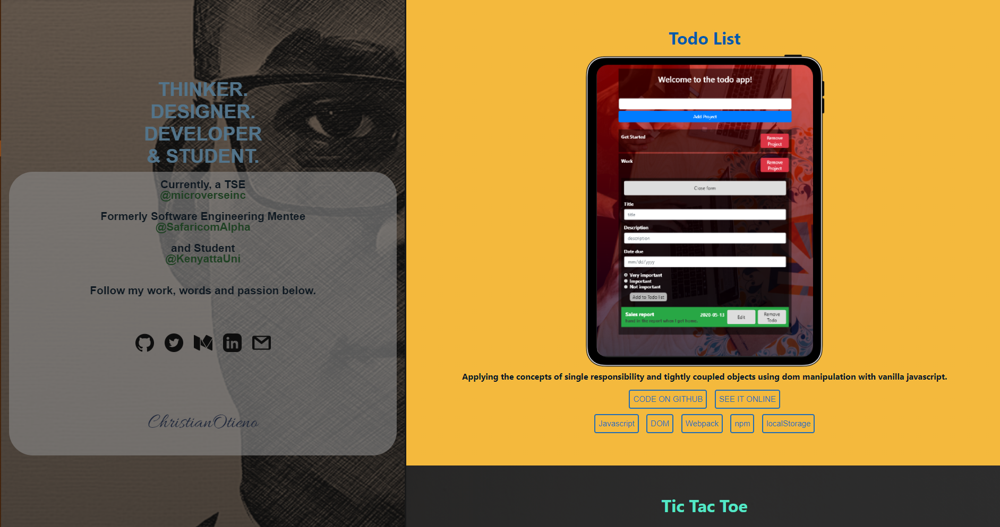

# Hi my name is Christian Otieno

## This is my Portfolio page code repository

- The website showcases some of my favorite projects in web development and the technologies I am best skilled at. It consists of a sticky right section that houses all the social links and what I am all about and a movable right section that contents the project presented in a list format.



A summary description of the project and its features illustrated below.

## Built With

- Bootstrap,
- HTML/SASS.

## Live Demo

[Live Link](https://christianotieno.github.io/)

## Getting Started

**Below are the instructions on setting up the project locally.**

To get a local copy up and running follow these simple example steps.

### Setup and installation

```
git clone git@github.com:christianotieno/christianotieno.github.io.git
```

### Usage

```
npm install
```

> This action will install all the project dependencies.

### Run tests

```
npx stylelint .
```

### Run the site

Run with a live server installed on your code editor.

## Authors Section

👤 **Christian Otieno**

- Github: [@christianotieno](https://github.com/christianotieno)
- Twitter: [@iamchrisotieno](https://twitter.com/iamchrisotieno)
- Linkedin: [Christian Otieno](https://www.linkedin.com/in/christianotieno/)

## 🤝 Contributing

Contributions, issues and feature requests are welcome!

Feel free to check the [issues page](https://github.com/christianotieno/christianotieno.github.io/issues).

## Show your support

Give a ⭐️ if you like this project!
